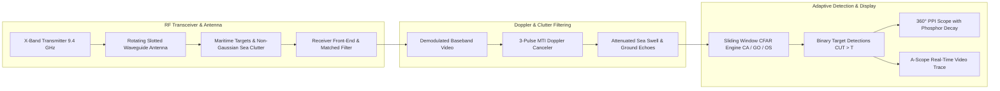

# SCANTER Naval Surveillance Radar Signal Processing Console

An interactive in-browser radar digital signal processing console demonstrating real-time target detection in severe sea clutter environments, modeling naval and coastal surveillance systems (such as the Terma SCANTER 5000 and 6000 series).

🔗 **Live In-Browser Simulator:** [https://elomarjc.github.io/naval-radar-signal-studio/](https://elomarjc.github.io/naval-radar-signal-studio/)

---

## 1. System Architecture & Radar Signal Chain

Coastal and naval surveillance radars detect small surface craft (such as RHIBs and stealth drones with $RCS < 1\text{ m}^2$) submerged beneath spiky, non-Gaussian sea clutter returns. Fixed detection thresholds either cause screen blinding from false alarms or miss small vessels.

This console models the complete digital radar signal processing chain in real time:



---

## 2. Mathematical Foundations

### 2.1 Radar Range Equation & Echo Power

Echo power $P_r$ returned from a target at range $R$ with radar cross section $\sigma$ is:

$$
P_r = \frac{P_t G^2 \lambda^2 \sigma}{(4\pi)^3 R^4 L}
$$

where $P_t$ is peak transmit power, $G$ is antenna gain, $\lambda = 3.19\text{ cm}$ ($X$-band), and $L$ represents system atmospheric and beam-shape losses.

The two-way horizontal antenna radiation pattern is approximated as:

$$
G(\theta) = G_0 \left( \frac{\sin(u)}{u} \right)^2, \quad u = 2.783 \frac{\theta}{\theta_{3\text{dB}}}
$$

where $\theta_{3\text{dB}} = 1.4^\circ$ is the half-power azimuth beamwidth.

---

### 2.2 Non-Gaussian Sea Clutter Statistical Modeling

Maritime backscatter from ocean waves exhibits spiky, non-Rayleigh tails modeled by the Weibull probability density function:

$$
f(x) = \frac{c}{b} \left( \frac{x}{b} \right)^{c-1} \exp\left( -\left( \frac{x}{b} \right)^c \right)
$$

where:
* $c = 1.35$ is the shape parameter reflecting sea roughness (smaller $c$ generates heavier tails / sharper clutter spikes).
* $b$ is the scale parameter governed by Douglas sea state and grazing angle $\psi$:

$$
b \propto \sigma_0 \cdot R^{-3}
$$

Inverse transform sampling generates synthetic clutter amplitudes:

$$
x_{\text{clutter}} = b \left( -\ln(U) \right)^{1/c}, \quad U \sim \mathcal{U}(0, 1)
$$

---

### 2.3 Constant False Alarm Rate (CFAR) Detection

A sliding window centered on the Cell Under Test ($CUT$, index $i$) measures background interference across $N = 32$ reference cells, protected by $G = 4$ guard cells.

The adaptive detection threshold is:

$$
T = \alpha \cdot Z
$$

* **Cell-Averaging CFAR (CA-CFAR):** Optimal in homogeneous Gaussian noise:

$$
Z_{\text{CA}} = \frac{1}{N} \sum_{k \in \text{Ref}} X_k, \quad \alpha_{\text{CA}} = N \left( P_{\text{fa}}^{-1/N} - 1 \right)
$$

* **Greatest-Of CFAR (GO-CFAR):** Selects the maximum of the leading and lagging window averages to prevent false alarm bursts at clutter boundaries:

$$
Z_{\text{GO}} = \max\left( \bar{X}_{\text{lead}}, \bar{X}_{\text{lag}} \right)
$$

* **Order-Statistic CFAR (OS-CFAR):** Ranks the reference cells in ascending order $X_{(1)} \le X_{(2)} \le \dots \le X_{(N)}$ and selects the $k$-th ranked sample ($k = 24$ of 32):

$$
Z_{\text{OS}} = X_{(k)}
$$

OS-CFAR prevents **target masking** where an interfering adjacent ship inflates the noise estimate and masks weaker companion targets.

---

### 2.4 Moving Target Indication (MTI) 3-Pulse Canceler

To attenuate stationary land returns and slow wave swells before detection, a 3-pulse canceler filter is applied across consecutive pulse repetition intervals:

$$
y[n] = x[n] - 2 x[n-1] + x[n-2]
$$

Discrete-time transfer function:

$$
H(z) = \left( 1 - z^{-1} \right)^2 = 1 - 2z^{-1} + z^{-2}
$$

Magnitude response:

$$
|H(\omega)| = 4 \sin^2\left( \frac{\omega T_{\text{PRI}}}{2} \right)
$$

Zero-Doppler clutter ($\omega = 0$) is completely eliminated ($|H(0)| = 0$), suppressing stationary land echoes by over $30\text{ dB}$.

---

## 3. Interactive Web Features

* **360° PPI Naval Radar Scope:** Hardware-accelerated radar sweep with true phosphor persistence fading, range rings ($6\text{--}24\text{ NM}$), coastline echoes, and tracking markers.
* **A-Scope Oscilloscope:** Real-time 1D range profile displaying raw video returns, dynamic CFAR threshold curves, and target detection hits.
* **CFAR Architecture Selector:** Instantly toggle between CA-CFAR, GO-CFAR, and OS-CFAR algorithms with live false alarm probability control ($P_{\text{fa}} = 10^{-6}\text{ to }10^{-3}$).
* **MTI Doppler Filter Toggle:** Activate pulse cancellation to watch coastline clutter vanish while high-speed surface craft remain illuminated.

---

## 4. Verification & Unit Tests

Unit tests verify CFAR detection sensitivity, OS-CFAR masking immunity, and MTI clutter cancellation:

```bash
node --test test/test_radar_dsp.mjs
```

Results:
* `CFARDetector`: Target detection across CA and OS algorithms verified.
* `CFARDetector`: OS-CFAR dual adjacent target resolution without masking verified.
* `MTIFilter`: 3-pulse canceler DC clutter rejection ($y[n] = 0$) verified.
* `RadarPhysics`: Radar kinematics and range bin mapping verified.

---

## 5. Author & Academic Context

* **Author:** Jacob El-Omar
* **Institution:** Aalborg University (AAU)
* **Academic Credentials:** Bachelor's Project in Electronic Engineering (Radar Signal Processing, Detection & Estimation Theory, Embedded Systems)
